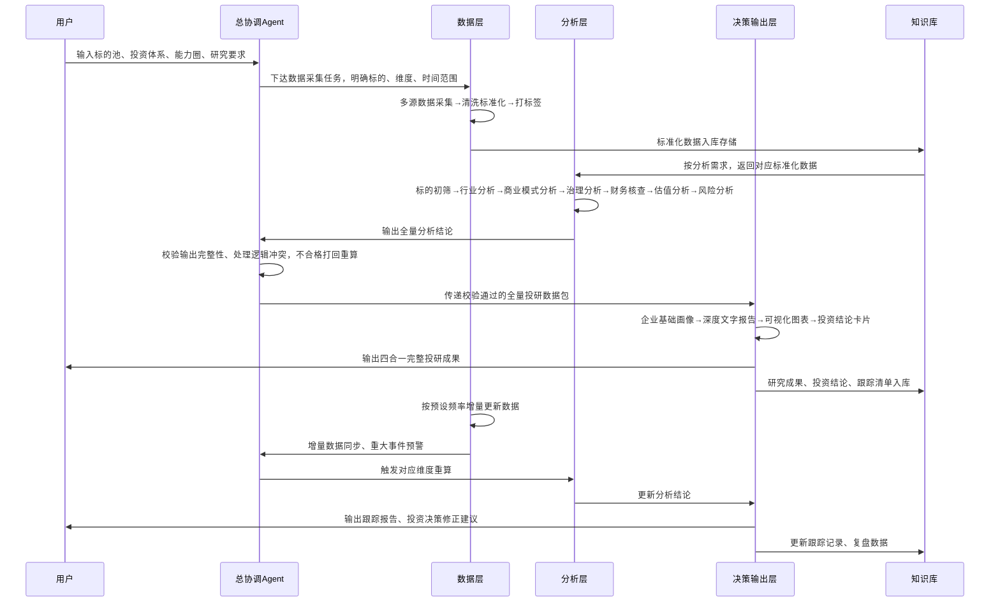

# 可直接落地开发的A股投研多Agent系统全量文档

本文档100%承接原8步闭环投研指南，完整落地你提出的4项核心优化：**数据与分析彻底拆分的极致分工、全量合规数据源、增量式投研知识库、四合一完整输出体系**，所有内容均为可直接开发、可执行的标准化设计，无模糊表述。

---

## 一、系统总览与核心设计原则

### 核心定位

面向个人/专业投资者的**闭环式A股投研决策多Agent系统**，从标的初筛到投资结论输出、动态跟踪全流程自动化，彻底解决“研究碎片化、信息堆砌、无法落地决策”的核心痛点。

### 核心设计原则（严格对齐原投研指南）

1. **职责单一极致拆分**：数据层只做数据拉取/清洗、分析层只做专业研判、决策层只做整合输出，无跨界职责，彻底解决“拉数分析混同”的问题

2. **一手资料优先级锁死**：强制遵循「招股说明书 > 历年年报 > 官方公告 > 监管问询函 > 券商研报 > 第三方信息」的检索优先级

3. **增量式知识库底座**：所有数据/研究成果沉淀到私有知识库，仅增量拉取更新数据，避免重复劳动，支持全量检索复用

4. **全链路可验证可反证**：所有分析结论必须附可量化数据，强制嵌入反证视角，无故事化、无模糊表述

5. **全场景输出覆盖**：从企业基础画像→深度文字报告→可视化图表→标准化投资结论卡片，全维度输出，解决“用户不了解企业基本情况”的痛点

### 系统三层核心架构（彻底拆分数据/分析/决策）

```mermaid
graph TB
    subgraph 决策层【决策输出层】
        A1[总协调Agent]
        A2[可视化与报告生成Agent]
        A3[投资结论收敛Agent]
        A4[动态跟踪与迭代Agent]
    end
    subgraph 分析层【专业分析层】
        B1[标的初筛与能力圈匹配Agent]
        B2[行业赛道与β分析Agent]
        B3[公司商业模式与α分析Agent]
        B4[公司治理与资本配置分析Agent]
        B5[财务质量与会计核查Agent]
        B6[估值定价与预期差分析Agent]
        B7[风险识别与情景分析Agent]
    end
    subgraph 数据层【数据底座层】
        C1[多源数据采集Agent]
        C2[数据清洗与标准化Agent]
        C3[投研知识库管理Agent]
        C4[增量数据更新Agent]
    end
    D[用户输入：标的池/投资体系/能力圈/跟踪需求] --> A1
    C1 --> C2 --> C3 --> 分析层
    分析层 --> A1
    A1 --> A2 --> A3 --> A4 --> E[最终输出：四合一完整投研成果]
    A4 --> C4 --> C3 --> 分析层
```
---

## 二、全量Agent角色与职责详解（可直接开发）

所有Agent均遵循「单一职责、输入输出标准化、校验规则明确」的原则，无职责重叠，无跨界操作。

### 第一层：数据底座层（只碰数据，不做任何分析研判）

#### 1. 多源数据采集Agent

- **核心定位**：全系统唯一数据入口，专属负责所有原始数据的合规拉取，不做任何加工、分析

- **专属职责**：

    1. 严格按照资料优先级，从指定数据源拉取对应原始数据，拒绝非合规数据源

    2. 按总协调Agent的任务指令，精准拉取指定个股/行业的对应维度数据

    3. 对拉取的原始数据做完整性校验，缺失数据立即反馈给总协调Agent

- **输入**：总协调Agent的任务指令（标的、数据维度、时间范围）、数据源授权接口

- **输出**：原始数据包（PDF/表格/文本格式，含来源标注、发布时间）

- **校验规则**：一手官方资料占比不得低于80%，券商研报仅作为辅助补充，禁止直接拉取第三方非合规信息

#### 2. 数据清洗与标准化Agent

- **核心定位**：把杂乱的原始数据转化为分析层可直接使用的标准化数据，解决“口径不一致、数据错误、重复冗余”问题

- **专属职责**：

    1. 原始数据去重、纠错、缺失值标注，剔除无效信息

    2. 财务指标、行业指标口径标准化（如统一营收/扣非净利润/ROIC的计算口径）

    3. 非结构化数据（年报/研报/公告）结构化拆分，提取关键信息字段

    4. 给所有数据打上标签（个股/行业/数据类型/时间/来源），便于知识库存储与检索

- **输入**：多源数据采集Agent输出的原始数据包

- **输出**：标准化数据集、结构化信息库、数据缺失/异常提示

- **校验规则**：所有指标必须标注计算口径，与A股通用会计准则、行业通用标准对齐，无口径模糊的数据

#### 3. 投研知识库管理Agent

- **核心定位**：全系统的私有数据底座，负责数据存储、分类、检索、复用，解决“重复拉取、资料零散、历史研究无法复用”问题

- **专属职责**：

    1. 按「个股库、行业库、宏观政策库、研报库、风险库、历史研究成果库」6大类，分类存储标准化数据

    2. 搭建向量检索引擎，支持分析层Agent精准调用对应数据

    3. 数据权限管理、版本管理，保留历史数据回溯能力

    4. 给增量数据更新Agent提供更新基准

- **输入**：数据清洗与标准化Agent输出的标准化数据集、分析层/决策层输出的研究成果

- **输出**：检索结果数据包、知识库更新日志、数据回溯对比表

- **校验规则**：所有存储数据必须标注来源、发布时间，可溯源、可验证，无来源数据禁止入库

#### 4. 增量数据更新Agent

- **核心定位**：负责知识库的动态更新，仅拉取增量/变更数据，避免全量重复拉取，保障数据时效性

- **专属职责**：

    1. 按预设频率，自动拉取更新数据：日更（公告、舆情、股价）、周更（行业高频指标、渠道数据）、季更（财报、机构持仓）、年更（年报、行业白皮书）

    2. 对比知识库基准数据，仅入库增量/变更数据，同步更新数据标签

    3. 触发式更新：监测到重大事件（业绩暴雷、监管问询、政策落地、实控人变更），立即拉取对应数据并入库

    4. 增量数据入库后，立即同步给总协调Agent，触发对应分析Agent重算

- **输入**：预设更新规则、触发式更新指令、数据源实时接口

- **输出**：增量数据集、更新提示、重大事件预警

- **校验规则**：增量数据必须与原有知识库分类对齐，无重复存储，重大事件必须1小时内完成数据更新

---

### 第二层：专业分析层（只做分析研判，不碰数据拉取/存储）

所有分析Agent仅从知识库调用标准化数据，输出纯分析结论，严格对应原投研指南的8步闭环流程，无职责遗漏。

|Agent名称|核心定位|输入|核心输出|强制校验规则|
|---|---|---|---|---|
|标的初筛与能力圈匹配Agent|对应原指南第一步，先做减法，锁定研究边界，拒绝无效研究|1. 用户定义的能力圈规则、投资体系；2. 知识库标的基础信息、风险数据|1. 初筛通过标的清单；2. 重点警示标的清单（附风险点）；3. 刚性剔除标的清单（附不可逆风险依据）|1. 非用户能力圈范围内的标的100%剔除；2. 刚性风险标的100%剔除，无遗漏；3. 所有筛选结论必须附可验证依据|
|行业赛道与β分析Agent|对应原指南第二步，定行业天花板，找核心定价因子|1. 初筛通过标的清单；2. 知识库行业数据、政策文件、格局数据|1. 行业生命周期与格局分析报告；2. 行业市场空间与增速测算表；3. 行业景气度分层指标库；4. 行业核心定价逻辑|1. 必须明确行业是增量/存量/收缩市场；2. 必须拆分先行/同步/滞后跟踪指标；3. 衰退期行业必须明确标注，无明确反转逻辑直接规避|
|公司商业模式与α分析Agent|对应原指南第三步，挖个股超额收益，验证盈利可持续性|1. 标的基础信息；2. 知识库业务拆解、单位经济模型、同行对比数据|1. 主营业务与盈利结构拆解表；2. 单位经济模型深度分析报告；3. 核心护城河量化验证结论；4. 空头反证观点清单（3个核心漏洞+证伪条件）|1. 所有护城河必须有可量化数据支撑，禁止“品牌优势强”等模糊表述；2. 必须输出反证观点，缺失则视为输出无效；3. 必须明确第二增长曲线的真实性验证结论|
|公司治理与资本配置分析Agent|对应原指南第四步，判长期生死，看股东回报底层逻辑|1. 标的股权、管理层、资本运作相关数据；2. 知识库历史公告、分红/回购/并购数据|1. 管理层能力与战略兑现度验证报告；2. 公司治理健康度评分；3. 资本配置能力深度分析报告；4. 股东背景辅助验证结论|1. 必须核查过往3年战略规划的兑现率；2. 必须拆解自由现金流的分配去向与投入产出比；3. 必须明确关联交易的公允性判断结论|
|财务质量与会计核查Agent|对应原指南第五步，验经营成色，排财务暗雷|1. 标的近3-5年财报数据；2. 同行对标财务数据；3. 知识库审计报告、问询函数据|1. 核心财务维度3-5年趋势与同行对比报告；2. 财务异常点与排雷清单；3. 现金流质量验证结论；4. 会计政策谨慎性对标结论|1. 必须做纵向趋势+横向同行双维度验证；2. 长期经营现金流为负必须给出明确的可逆性验证结论；3. A股高发财务造假点必须100%覆盖核查|
|估值定价与预期差分析Agent|对应原指南第六步，定安全边际，找超额收益来源|1. 财务分析结论；2. 行业β分析结论；3. 知识库一致预期、同行估值、历史估值数据|1. 市场一致预期梳理清单；2. 多方法估值测算结果与合理估值区间；3. 核心预期差分析报告；4. 收益来源拆解表|1. 禁止单一PE估值，必须按行业/公司阶段匹配适配的估值方法；2. DCF模型必须用于验证当前股价隐含的假设合理性，而非算出精确数值；3. 必须明确与市场一致预期的核心差异，及可验证的支撑依据|
|风险识别与情景分析Agent|对应原指南第七步，做极端预案，定判断失效边界|1. 上述所有分析Agent的输出结论；2. 知识库风险数据、政策动态、股价供需数据|1. 全维度风险清单（标注发生概率+影响程度）；2. 乐观/中性/悲观三情景业绩与估值测算表；3. 核心逻辑失效条件清单；4. 对应风控预案|1. 必须覆盖宏观/行业/公司/黑天鹅全维度风险；2. 必须重点测算悲观情景下的最大下跌空间；3. 失效条件必须可量化、可触发，无模糊表述|
---

### 第三层：决策输出层（只做整合、可视化、决策收敛、动态跟踪）

#### 1. 总协调Agent（全系统中枢）

- **核心定位**：全流程任务拆解、调度、校验、冲突处理，保障系统闭环运行

- **专属职责**：

    1. 接收用户输入，拆解为各Agent的标准化子任务，设定完成时限

    2. 调度各Agent按流程执行，前序Agent输出校验通过后，才触发下一个Agent执行

    3. 校验所有Agent的输出完整性、合规性，不符合规则的直接打回重算

    4. 处理跨Agent的逻辑冲突（如估值结论与风险结论矛盾），触发二次验证

    5. 整合所有分析层的输出，形成完整的投研数据包，传递给可视化与报告生成Agent

    6. 接收增量数据更新Agent的预警，触发对应Agent重算，启动动态迭代流程

- **输入**：用户指令、各Agent的输出结果、增量数据预警

- **输出**：任务调度指令、输出校验结果、整合后的全量投研数据包、重算指令

#### 2. 可视化与报告生成Agent

- **核心定位**：把零散的分析结论，转化为结构化的深度文字报告+可视化图表，解决“输出太简单、用户看不懂”的痛点

- **专属职责**：

    1. 基于全量投研数据包，生成连贯、闭环的深度文字分析报告

    2. 自动生成配套的可视化图表，标注数据来源、时间范围

    3. 补全企业基础画像，让用户快速了解企业核心情况

    4. 按用户需求，调整报告的详略程度（极简版/标准版/深度版）

- **输入**：总协调Agent整合的全量投研数据包

- **输出**：企业基础画像、深度文字分析报告、全量可视化图表包

- **校验规则**：所有图表必须与分析结论一一对应，所有数据必须标注来源，无数据支撑的文字表述禁止出现

#### 3. 投资结论收敛Agent

- **核心定位**：对应原指南第八步，把所有研究内容收敛为可执行的投资决策，是系统的最终核心输出

- **专属职责**：

    1. 基于全量投研数据，生成标准化投资结论卡片，无模糊表述

    2. 锁定未来6-12个月的核心催化剂与时间窗口

    3. 搭建分层跟踪清单体系，明确跟踪频率与触发条件

    4. 制定动态修正与决策迭代规则

- **输入**：全量投研数据包、可视化报告的核心结论

- **输出**：标准化投资结论卡片、核心催化剂清单、分层跟踪体系、决策迭代规则

- **校验规则**：核心投资逻辑必须3句话以内说清，失效条件必须可触发，仓位建议必须匹配风险等级，无“逢低买入”等模糊表述

#### 4. 动态跟踪与迭代Agent

- **核心定位**：保障投研结论的动态更新，解决“买入后就停止研究”的痛点

- **专属职责**：

    1. 按分层跟踪清单，定期校验指标是否符合预期，输出跟踪周报/季报

    2. 监测风险触发指标，一旦触发立即反馈给总协调Agent，启动投资逻辑重评估

    3. 核心催化剂时间窗口临近时，提前发出跟踪提示

    4. 定期复盘投资结论的兑现度，优化系统各Agent的分析规则

- **输入**：分层跟踪清单、增量更新数据、催化剂时间节点

- **输出**：跟踪报告、风险触发预警、催化剂提示、复盘优化建议

- **校验规则**：风险触发指标必须实时响应，无延迟，跟踪报告必须明确标注“符合预期/低于预期/超预期”，无模糊表述

---

## 三、投研专属知识库全量设计（增量拉取+全量复用）

### 1. 知识库整体架构

采用「1个主库+6个子库」的分类架构，所有数据统一标签体系，支持精准检索与回溯

```Plain Text

投研私有知识库
├── 个股基础库（按个股代码分类）
│   ├── 基础信息、招股说明书、历年财报/季报
│   ├── 官方公告、监管问询函与回复、投资者关系记录
│   ├── 财务拆解数据、业务结构数据、资本运作数据
│   └── 历史研究成果、跟踪记录
├── 行业数据库（按申万/证监会行业分类）
│   ├── 行业白皮书、政策文件、监管规则
│   ├── 市场空间、格局集中度、景气度高频数据
│   ├── 行业深度研报、历史周期复盘数据
│   └── 同行对标数据库
├── 宏观政策库
│   ├── 宏观经济数据、货币政策、财政政策
│   ├── 资本市场监管规则、行业重大政策
│   └── 宏观事件影响复盘数据
├── 研报资料库
│   ├── 券商行业深度研报、公司深度研报
│   ├── 盈利预测汇总、估值逻辑分析
│   └── 风险提示、反证观点汇总
├── 风险特征库
│   ├── 财务造假特征、退市风险标的清单
│   ├── 合规处罚记录、负面舆情数据库
│   └── 历史黑天鹅事件复盘数据
└── 投资决策库
    ├── 历史投资结论卡片、跟踪复盘记录
    ├── 情景分析模型、估值模型模板
    └── 投资体系规则、能力圈边界定义
```

### 2. 核心增量更新机制

|数据类型|更新频率|触发条件|更新范围|
|---|---|---|---|
|个股公告、负面舆情、股价数据|日更|每日收盘后自动触发；重大公告实时触发|仅新增公告、舆情数据，不重复存储|
|行业高频景气度指标、渠道库存、产品价格|周更|每周日自动触发|增量更新本周数据，同步更新趋势曲线|
|财报、机构持仓、券商一致预期|季更|财报季结束后自动触发|新增季度数据，更新同行对标库|
|年报、行业白皮书、年度战略规划|年更|年报披露期结束后自动触发|新增年度全量数据，更新生命周期与格局判断|
|重大事件（业绩暴雷、监管问询、政策落地、实控人变更）|实时更新|事件触发后1小时内完成|新增事件相关全量数据，同步触发风险预警|
### 3. 向量检索与复用规则

- 检索优先级：个股库 > 行业库 > 宏观政策库 > 研报库，严格遵循一手资料优先

- 检索权限：分析层Agent仅可调用对应职责范围内的知识库数据，无全库检索权限，避免信息冗余

- 复用规则：同一标的的历史研究成果，仅增量更新变化部分，不重复分析已验证的固定结论（如公司主营业务、护城河基础判断）

---

## 四、全量合规数据源清单（补全无死角，标注优先级）

严格遵循一手官方资料优先原则，分「免费普惠版（个人投资者可用）、进阶付费版（专业投资者）、高频替代数据源」三类，覆盖投研全维度需求，无信息遗漏。

### 1. 核心一手官方数据源（优先级★★★★★，强制必接）

|数据类型|具体来源|可获取内容|对接方式|
|---|---|---|---|
|个股合规公告/财报|巨潮资讯网、沪深北交易所官网|招股说明书、年报/季报、官方公告、监管问询函、投资者关系记录|官方API、合规爬虫|
|监管合规数据|证监会官网、证监会诚信档案、信用中国|上市公司合规处罚记录、实控人/高管违法违规记录、行业监管规则|官方网站、API|
|行业官方数据|国家统计局、对应部委官网、行业协会官方网站|行业宏观数据、产量/销量/渗透率数据、政策文件、行业标准|官方API、公开数据下载|
|专利/知识产权数据|国家知识产权局官网|上市公司专利数量、技术壁垒验证数据|官方API、合规爬虫|
|工商/股权数据|企查查、天眼查、国家企业信用信息公示系统|实控人信息、股权结构、关联交易、对外投资、司法风险|官方API、付费接口|
### 2. 免费普惠数据源（优先级★★★★，个人投资者首选）

|数据类型|具体来源|可获取内容|
|---|---|---|
|财务/估值/行情数据|东方财富网、同花顺免费端、理杏仁、雪球|个股财务数据、同行对标、历史估值分位、行情数据、投资者舆情|
|券商研报/调研纪要|慧博投研资讯、同花顺研报中心、东方财富研报平台|行业深度研报、公司深度研报、调研纪要、盈利预测汇总|
|消费需求高频数据|百度指数、微信指数、抖音指数|消费品牌热度、需求趋势、用户关注度变化|
|大宗商品/周期品数据|卓创资讯免费端、我的钢铁网免费端|产品价格、库存、开工率高频数据|
### 3. 进阶付费数据源（优先级★★★，专业投资者/机构必备）

|数据类型|具体来源|可获取内容|
|---|---|---|
|全量金融数据库|Wind、同花顺iFinD、Choice金融终端|全市场个股/行业/宏观数据、一致预期、高频景气度数据、估值模型|
|行业高频数据|萝卜投研、卓创资讯付费端、上海钢联、Wind行业数据库|细分行业月度/周度/日度高频数据、渠道库存、订单数据|
|另类替代数据|汇智通达、万得另类数据、招聘数据平台|上市公司物流数据、工业用电数据、招聘数据、门店扩张数据|
|舆情/风险预警数据|同花顺舆情、东方财富舆情、财新舆情|上市公司负面舆情、政策舆情、市场情绪实时监测|
---

## 五、系统全流程协作时序（闭环运行逻辑）


---

## 六、完整标准化输出模板（四合一全维度，解决用户认知痛点）

### 最终输出固定结构，按顺序呈现，小白也能快速看懂

---

#### 第一部分：【企业基础画像卡片】（放在最前面，解决“用户不知道企业基本情况”的痛点）

|核心维度|标准化信息|
|---|---|
|基础标识|公司全称：XXX；股票代码：XXX；上市板块：XXX；上市时间：XXX|
|实控人与股权|实控人：XXX；实控人性质（国资/民营/外资）：XXX；前三大股东持股比例：XXX；股权质押率：XXX|
|核心业务与盈利|主营业务：XXX；核心盈利产品/业务：XXX；盈利模式（赚产品差价/服务费/特许经营收益）：XXX；客户类型（ToB/ToC）：XXX|
|行业地位|所属细分行业：XXX；行业梯队：XXX；核心产品市占率：XXX；行业CR5/CR10：XXX|
|核心标签|资产模式（重资产/轻资产）：XXX；行业生命周期：XXX；核心优势标签：XXX；核心风险标签：XXX|
---

#### 第二部分：【深度文字分析报告】（闭环连贯，逻辑对齐原投研指南）

##### 一、行业β分析：赛道天花板与核心定价逻辑

1. 行业生命周期与竞争格局

2. 市场空间、增速与核心驱动因素

3. 行业监管导向与核心景气度指标

4. 行业核心定价逻辑与历史估值复盘

##### 二、公司α分析：商业模式与核心竞争力

1. 主营业务与盈利结构深度拆解

2. 单位经济模型验证与盈利可持续性分析

3. 核心护城河量化验证与同行对比

4. 反证视角：核心漏洞与逻辑证伪条件

##### 三、公司治理与资本配置能力分析

1. 管理层能力与战略兑现度验证

2. 公司治理结构健康度评估

3. 资本配置能力与股东回报分析

4. 股东背景与机构持仓分析

##### 四、财务质量深度核查结论

1. 成长性、盈利能力、营运能力、偿债能力3-5年趋势与同行对比

2. 现金流质量与盈利含金量验证

3. 财务异常点与排雷结论

4. 会计政策谨慎性对标结论

##### 五、估值定价与预期差分析

1. 当前市场一致预期梳理

2. 多方法估值测算与合理估值区间

3. 核心预期差：与市场一致预期的核心差异

4. 未来收益来源拆解

##### 六、风险识别与情景分析

1. 全维度核心风险清单（概率+影响程度）

2. 乐观/中性/悲观三情景业绩与估值测算

3. 核心投资逻辑失效条件

4. 对应风控预案

---

#### 第三部分：【配套可视化图表包】（自动生成，一图胜千言）

强制生成以下核心图表，所有图表标注数据来源、时间范围：

1. 近3-5年核心财务指标趋势图（营收、扣非净利润、毛利率、净利率、ROE）

2. 现金流质量对比图（经营活动现金流净额、净利润、净现比、收现比）

3. 估值分位图（PE/PB近3年/5年/上市以来历史分位，标注当前位置）

4. 行业竞争格局饼图/柱状图（CR5/CR10集中度，标的行业梯队位置）

5. 同行对标对比图（盈利能力、估值水平、营运能力同行横向对比）

6. 三情景分析测算图（乐观/中性/悲观情景下的业绩与股价空间）

7. 核心景气度跟踪指标趋势图（先行指标、同步指标趋势）

---

#### 第四部分：【标准化投资结论卡片】（可直接落地执行，无模糊表述）

|模块|核心内容（简洁、可验证、无模糊表述）|
|---|---|
|核心投资逻辑|3句话以内说清：这家公司为什么值得买，核心α来自哪里|
|核心预期差|我的判断与市场一致预期的核心差异是什么|
|核心催化剂|未来6-12个月，推动股价上涨的核心事件与对应时间窗口|
|核心可验证假设|支撑投资逻辑的3个核心可量化假设|
|估值与交易区间|合理估值区间：XXX；安全买入区间：XXX；止盈区间：XXX|
|预期收益拆解|业绩增长贡献：XXX%；估值修复贡献：XXX%；分红收益：XXX%；合计预期收益：XXX%|
|核心风险|3个最可能发生、影响最大的核心风险|
|逻辑失效条件|出现什么可量化的事件/数据，立即承认判断错误，止损离场|
|仓位建议|单标的仓位上限：XXX%；对应投资周期：XXX|
|分层跟踪规则|高频跟踪指标：XXX（每周/每月更新）；定期验证指标：XXX（季报/年报更新）；风险触发指标：XXX（实时跟踪）|
---

## 七、分阶段开发落地实施步骤

### 第一阶段：轻量版（个人投资者，1-2周可落地，零成本）

1. 技术选型：LangChain + Chroma向量数据库 + GPT-4/DeepSeek大模型 + 免费数据源接口

2. 核心落地：先搭建数据层3个核心Agent（采集/清洗/知识库）+ 分析层3个核心Agent（初筛/财务/估值）+ 决策层2个Agent（总协调/结论输出）

3. 输出成果：先实现基础画像+投资结论卡片，逐步叠加深度报告与图表

4. 核心优势：零成本、快速落地，满足个人投资者基础投研需求

### 第二阶段：进阶版（专业投资者，1-2个月可落地，低代码）

1. 技术选型：MetaGPT + Pinecone向量数据库 + 国内合规大模型 + 付费金融数据接口

2. 核心落地：全量Agent落地，完善增量更新机制、动态跟踪体系、可视化图表自动生成

3. 输出成果：完整四合一全量投研成果，支持批量标的初筛与深度研究

4. 核心优势：自动化程度高，满足专业投资者多标的、高频跟踪需求

### 第三阶段：企业版（机构用户，3-6个月可落地，全功能）

1. 技术选型：私有化部署大模型 + 分布式向量数据库 + 合规金融数据专线 + 量化交易接口对接

2. 核心落地：全量功能完善，添加回测模块、组合管理模块、风控预警模块，支持团队协作

3. 输出成果：机构级投研报告、投资决策建议、组合跟踪报告、风险预警报告

4. 核心优势：私有化部署，数据安全，支持机构级投研与交易落地

---

## 八、系统核心风控与避坑规则（强制嵌入全流程）

1. **能力圈锁死规则**：初筛Agent强制执行白名单制，非用户能力圈范围内的标的，直接终止后续所有分析

2. **反证强制规则**：商业模式分析Agent、风险分析Agent必须输出反证观点与失效条件，缺失则视为输出无效，总协调Agent直接打回

3. **可验证性规则**：所有分析结论必须附可量化、可溯源的数据支撑，无数据支撑的模糊表述，禁止出现在最终输出中

4. **资料优先级规则**：数据采集Agent必须严格遵循一手官方资料优先原则，一手资料占比不得低于80%，禁止直接照搬券商研报的买入评级与盈利预测

5. **风险前置规则**：所有投资结论必须先明确最大下跌空间与失效条件，再给出买入建议，禁止只谈收益不谈风险

6. **动态迭代规则**：跟踪阶段，一旦核心逻辑失效条件被触发，必须立即输出止损/修正建议，禁止固执于原有判断
> （注：文档部分内容可能由 AI 生成）